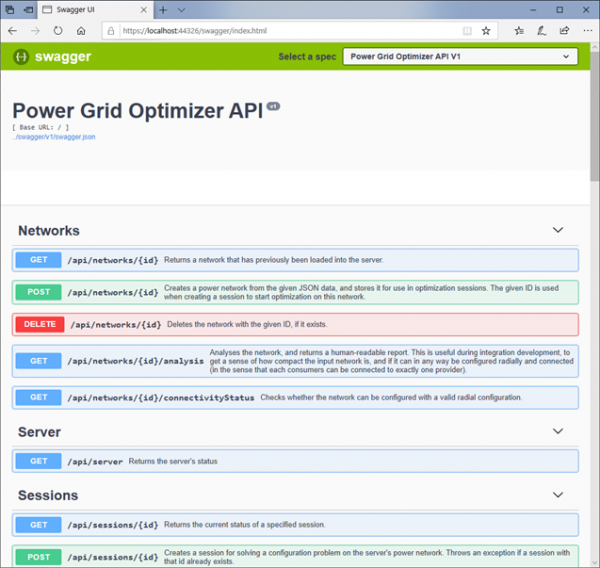

# Background

The Power Grid Optimiser is a software service for computing the optimal configuration of a power grid. That is, how to use switches and other grid components to optimise reliability, loss, balance, power quality, and so on.

This grid configuration task is formulated as a combinatorial optimisation problem, and solved using a suite of suitable search methods, both exact and approximate. By solving variations of this problem efficiently, the technology enables considerable savings on several levels in [DSO](http://energywiki.eyp.org/view/Distribution_System_Operators_(DSOs))/[TSO](http://energywiki.eyp.org/view/Transmission_System_Operator) operations, ranging from long term investment analysis, through a dynamic adaptation of the grid based on short term prognosis, to here-and-now re-configuration during maintenance or fault corrections.

This document contains a brief introduction to what the PGO is, and what it can do.

## Concept

DSOs aim to develop and manage their distribution grid in a way that is cost efficient, maximizes customer satisfaction, and minimizes disruptions due to failure of grid components or maintenance. The ability to determine the optimal network configuration in different situations is therefore central to many DSO decision processes, from long term strategic planning to dynamic re-configuration in daily operations. While each of these applications have unique features, they all depend on the ability to determine a network configuration that is optimal in some sense, e.g. with respect to power loss, reliability (incl. reserve capacity and expected loss of energy not delivered (“KILE”)), load distribution, cost of flexibility, customer satisfaction, and other quality measures.

Note that we by the term “network configuration”, in general mean a combination of network switch settings and targeted use of flexible energy resources (flexible demand, production, and storage). As a start, however, we have considered only switch settings.

Currently, the PGO supports two applications:

1. The computation of a static “default configuration” for a distribution grid. Today, such default configurations are normally chosen based on a manual investigation of a very small number of possible configurations. It is likely that configuration chosen in this way is not an optimal one, and that a better configuration may be found with the proper tools.
2. The computation of a configuration schedule. That is, a sequence of configurations over a number of time steps. This can be used in daily operations to make minor adjustments to the near-future configurations. The aim is to remove predicted bottlenecks that appear due to variation in demand and/or component vulnerability (due to weather), and so ensure a stable delivery.

Furthermore, the PGO may be used to evaluate any existing configuration, by computing the associated power flow and measuring the relevant quality criteria.

We expect that usage of the PGO may achieve significant savings and added grid robustness, as compared to the present practice of manually evaluating only a few candidate configurations. Furthermore, the technology can be developed further for decision support in a range of different planning- and management tasks.

## Using the PGO service

For a fast touch-and-feel introduction, please try out our [web application](https://pgosintef.azurewebsites.net/#/). This is a simple web-based user interface which you can use to access the PGO server and try out some grid configuration optimisation. The user manualfor the web application is [here](demo-client-user-manual.md).

### The API

The API is http-based (see Figure 2). Simply put, this API can be used programmatically to:

 * Upload a grid definition to the PGO server, e.g. taking data from third party software.
 * Create an optimization session, by uploading a forecasted or estimated demand for each consumer
 * Define the optimisation criterion by setting relative weight for quality measures such as “thermal loss” or “Expected cost of energy not delivered”.
 * Run an optimisation for this session, to produce a (near) optimal configuration for the associated demand.
 * Download the resulting configuration, along with the associated power flow, for local visualization or insertion into third party software.
 * Upload any configuration that may have been otherwise produced outside the PGO, and have it evaluated in terms of power flow and configuration quality.

|  | 
|:--:| 
| *The service comes with a complete on-line API reference documentation* |

For more detailed information about how to integrate and use the PGO service in a production setting, take a look at our [Documentation pages](documentation.md).

### Input data

The data that are necessary for using the PGO are:

 * The distribution network data, including grid topology and the necessary physical properties of switches, lines, buses, and transformers. These are typically taken from the DSO’s “NIS” system.
 * Demand data: For a default configuration, this is a single demand figure for each of the consumers. The data source for these data will depend on what you want to compute; they can represent a normal average situation, a winter scenario, a worst-case scenario, etc.

Out of convenience, we have so far used a proprietary json-based format for defining the grid data. In the future, we aim to support a direct import of CIM-based data, probably conforming to the results of the DIGIN project.

## Model and algorithms

This section gives a high-level overview of how we have defined the grid configuration optimisation problem, and the various research challenges that we have addressed to solve it.

As mentioned above, we limit our definition of “grid configuration” to determining an optimal setting for each switch in the grid.  In Norway, it is normally assumed that feasible configurations must be “radial”, in the sense that in the resulting (configured) grid there is exactly one path from each bus to a substation (i.e., each bus gets power through exactly one connecting path from the higher-voltage transmission grid). Furthermore, a feasible configuration must comply with current and voltage limits set for the various grid components. Therefore, to determine whether a configuration is feasible, the corresponding power flow must be computed for the entire grid. This computation is also the basis for evaluating the quality of the configuration, e.g. in terms of robustness or power loss.

The number of possible configurations is 2n, where n is the number of available switches. This “exponentially exploding” number of possible configurations makes this a “hard” combinatorial optimization problem. Solving the problem is made even more challenging by the need to compute the power flow for every configuration that is considered, a computation that in itself is time consuming. 

To develop this prototype, our challenge was to:

 * Develop an efficient (heuristic) optimisation algorithm for grid configuration
 * Develop an efficient power flow computation method, for use in the optimisation algorithm
 * Develop an easy-to-use API, to facilitate integration with DSO legacy systems.
 * Testing of the PGO prototype on real distribution net data.

The PGO employs a “meta-heuristic” search method for solving the optimisation algorithm, based on a fast heuristic for constructing radial solutions, a local search for improving such solutions, and a “ruin-and-recreate” diversification strategy. For the power flow calculations, we use an efficient “iterative” implementation of the “Simplified DistFlow” algorithm, the efficiency of which rests on the assumption of radiality. Other power flow algorithms are also included that can handle also “non-radial” configurations, but these are not competitive for radial networks.

The PGO prototype has been evaluated on synthetic test data. Furthermore, we have tested that it seems to produce good solutions on real world data from DSOs. Further testing and validation is on-going.

## Roadmap

The current version of the PGO computes a (near) optimal grid configuration for a given description of the distribution grid and estimated consumer demands. This ability is central to a wide range of DSO planning and management applications, in which the goal is to ensure grid robustness (reserve capacity, KILE), while minimising costs and maximizing customer satisfaction.

Other than the computation of a static “default” configuration or a short term configuration sequence, such applications include:

 * General what-if analysis, answering questions such as “what are the consequences if..:
   * a certain grid component fails?
   * we connect a new customer here (or, how large a customer can we connect here)?
   * we can exploit a certain level of demand response flexibility at a certain location?
   * we replace or upgrade certain grid components, such as cables or transformers?
   * we invest in remote-controlled switches, or new batteries?
   * Etc.
 * More advanced investment analysis, such as:
   * What is the best combination of upgrades?
   * If we invest in remote-controlled switches, where should they be placed?
 * Operational grid management applications, such as a short-term re-configuration of the grid to tackle forecasted power flow bottlenecks, or optimal re-configuration during fault correction or maintenance.

To evaluate the “best possible” impact of any change to the distribution grid, one should determine the corresponding best possible network configuration. This would enable the planner to consider the total impact across the whole grid (assuming a suitable re-configuration will be made after the change). Today, without planning tools with this ability, it is not possible to “see the whole picture”. Instead, planning decisions are based on simpler, more local considerations.

The continued development of the PGO aims to resolve this situation.

## Acknowledgements

The PGO has been developed through the research and innovation projects Energytics and Kognigrid.

