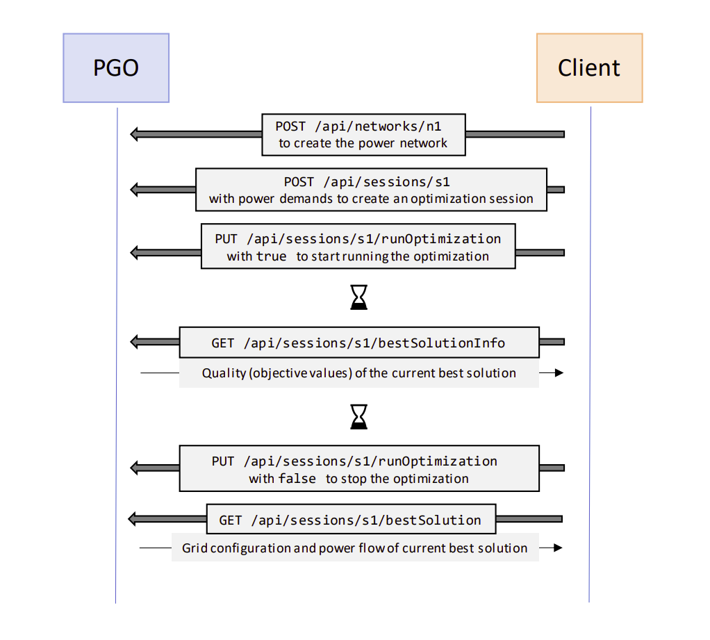

# Getting started using the API

In an actual deployment, the proper endpoints should be used, but it is also possible to test through Swagger. Here we illustrate the intended flow of the service.

1. `POST /api/networks/n1` with a network JSON file in the request body to load a power network and name it `n1`.
2. `GET /api/networks/n1/analysis` can optionally be called to analyse the loaded network and flag any issues with the network structure that might cause problems for the optimization.
3. `POST /api/sessions/s1` to create a session with id `s1` and give a forecast JSON file in the request body. Here, a start configuration JSON file may also be given.
4. `PUT /api/sessions/s1/runOptimization` with `true` in the request body to start the optimization.
5. Wait a minute or so. The optimizer works iteratively, and the current state can be polled with `GET /api/sessions/s1` or (for more details) `GET /api/sessions/s1/bestSolutionInfo`.
6. When a solution is desired, it can be retrieved with `GET /api/sessions/s1/bestSolution`.
7. To halt the solver work, `PUT /api/sessions/s1/runOptimization` with false in the request body.



See also the [full API reference](https://pgosintef.azurewebsites.net/swagger/index.html).

## How to authenticate with the Power Grid Optimizer API


When using the Power Grid Optimizer API, you are required to pass a bearer token along with your requests. The bearer token is received from a separate authentication endpoint in Azure.

To acquire a bearer token, send a POST request to https://login.microsoftonline.com/061e3366-f8d3-4124-83e5-7c78e66a78db/oauth2/v2.0/token . The body should consist of form data with the following fields:

 * client_id: (Obtained from SINTEF)
 * client_secret: (Obtained from SINTEF)
 * grant_type: client_credentials
 * scope: https://sintefconnect.onmicrosoft.com/4f57874f-66d5-4727-af75-b5da36bdf533/.default
 * 
The response will be JSON containing an access token under the key “access_token“. When sending requests to Power Grid Optimizer endpoints, add the token to the Authorization header, preceeded by the word “Bearer” like so:

```
Authorization: Bearer <token>
```

This header should be added to all HTTP API requests, both on SINTEFs cloud instance and on locally deployed Docker image instances.

