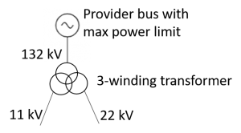

## Modelling examples

In this article we will provide some simpler example models of power grids, to make it easier to see how the software might be used. The reader is asked to mostly ignore the physical properties, like voltage and generation limits — these cases are made for readability and illustrative purposes. All of these examples can be run with the following simple forecast of 0.5 MW for the single load present:

```json
{
  "periods": [
    {
      "id": "Example period",
      "start_time": "2020-01-01T00:00Z",
      "end_time": "2021-01-01T00:00Z"
    }
  ],
  "loads": [{ "node_id": "Load", "p_loads": [0.5], "q_loads": [0] }],
  "@schema_version": 1
}
```

### A provider and a consumer

The simplest possible network is shown below.


Represented as JSON the network looks as follows.

```json
{
  "name": "A provider and a consumer",
  "nodes": [
    {
      "id": "Source",
      "type": "provider",
      "v_gen": 22,
      "p_gen_max": 1,
      "p_gen_min": 0,
      "q_gen_max": 1,
      "q_gen_min": 0
    },
    { "id": "Load", "type": "consumer", "v_min": 20, "v_max": 24 }
  ],
  "lines": [
    {
      "id": "line",
      "source": "Source",
      "target": "Load",
      "r": 1,
      "x": 1
    }
  ],
  "@schema_version": 1
}
```

### Switching

A case with two switches is shown in the following image.

#

In the grid definition below we have set a high resistance on the line connecting the load to Source 2, which should mean the solution connects with Source 1.

```json
{
  "name": "Two providers and a consumer",
  "nodes": [
    {
      "id": "Source 1",
      "type": "provider",
      "v_gen": 22,
      "p_gen_max": 1,
      "p_gen_min": 0,
      "q_gen_max": 1,
      "q_gen_min": 0
    },
    {
      "id": "Source 2",
      "type": "provider",
      "v_gen": 22,
      "p_gen_max": 1,
      "p_gen_min": 0,
      "q_gen_max": 1,
      "q_gen_min": 0
    },
    {
      "id": "Junction",
      "type": "transition",
      "v_min": 20,
      "v_max": 22
    },
    { "id": "Load", "type": "consumer", "v_min": 20, "v_max": 24 }
  ],
  "lines": [
    {
      "id": "Source 1-Junction line",
      "source": "Source 1",
      "target": "Junction",
      "r": 1,
      "x": 1,
      "switchable": true,
      "switching_cost": 0
    },
    {
      "id": "Source 2-Junction line",
      "source": "Source 2",
      "target": "Junction",
      "r": 100000000,
      "x": 100000000,
      "switchable": true,
      "switching_cost": 0
    },
    {
      "id": "Junction-Load line",
      "source": "Junction",
      "target": "Load",
      "r": 1,
      "x": 1
    }
  ],
  "@schema_version": 1
}
```

An example output from running this case through the service (see [Getting started using the API](api-getting-started.md)) shows that the correct line is opened (i.e. in effect removed from the network):

```json
{
  "period_solutions": [
    {
      "switch_settings": [
        {
          "id": "Source 1-Junction line",
          "open": false
        },
        {
          "id": "Source 2-Junction line",
          "open": true
        }
      ],
      "period": "Example period"
    }
  ],
  "flows": [
    {
      "voltages": {
        "Source 1": 22.0,
        "Source 2": 22.0,
        "Junction": 21.97719017390563,
        "Load": 21.954403899598042
      },
      "currents": {
        "Source 1": [
          {
            "target": "Junction",
            "current": 0.022774473963699665
          }
        ],
        "Junction": [
          {
            "target": "Load",
            "current": 0.022774473963701861
          }
        ]
      },
      "injected_power": {
        "Source 1": [
          {
            "target": "Junction",
            "active": 0.50103735332858856,
            "reactive": 0.0010373533285885337
          }
        ],
        "Junction": [
          {
            "target": "Load",
            "active": 0.50051867666431349,
            "reactive": 0.00051867666431347579
          }
        ]
      },
      "period": "Example period"
    }
  ]
}
```


### A transformer

To illustrate the modeling of transformers, we now assume the source voltage doesn’t match the load voltage, in the following model:


Here we add a transition node at each side of the transformer, and then specify the transformer to operate in “automatic” mode, halving the voltage. The transformer voltage limits are handled through using transition nodes, represented like this as JSON:

```json
{
  "name": "A provider, a transformer and a consumer",
  "nodes": [
    {
      "id": "Source",
      "type": "provider",
      "v_gen": 22,
      "p_gen_max": 1,
      "p_gen_min": 0,
      "q_gen_max": 1,
      "q_gen_min": 0
    },
    { "id": "Load", "type": "consumer", "v_min": 10, "v_max": 12 },
    {
      "id": "Transformer primary",
      "type": "transition",
      "v_min": 20,
      "v_max": 24
    },
    {
      "id": "Transformer secondary",
      "type": "transition",
      "v_min": 10,
      "v_max": 12
    }
  ],
  "lines": [
    {
      "id": "Source-Transformer line",
      "source": "Source",
      "target": "Transformer primary",
      "r": 0.1,
      "x": 0.1
    },
    {
      "id": "Transformer-Load line",
      "source": "Transformer secondary",
      "target": "Load",
      "r": 0.1,
      "x": 0.1
    }
  ],
  "transformers": [
    {
      "id": "Transformer",
      "connections": [
        { "node_id": "Transformer primary", "end_voltage": 22 },
        { "node_id": "Transformer secondary", "end_voltage": 11 }
      ],
      "modes": [
        {
          "source": "Transformer primary",
          "target": "Transformer secondary",
          "operation": "automatic"
        }
      ]
    }
  ],
  "@schema_version": 1
}
```

### Modelling 3-winding transformers

Often, a provider is in reality a transforer that connect the distribution grid to the high voltage transmission grid. Normally, this can be modelled as a single node, as in the examples above. However, sometimes this transformer is a “3-winding” one, with two connections to the distribution grid that may have different voltages. Often, this can be modelled as two single node providers, but if you want to express that the transformer has a total power capacity that is shared between the two downstream connections, you can model that as a combination of:

 * A single high voltage provider, with the power capacity limit.
 * A 3-winding transformer, where the high voltage connection is to the high voltage provider, and the two other connections are the two connections to the distribution grid.

Graphically, it looks like this:



A graph with such a transformer would include the following definitions:

```json
{
  "name": "PowerNetwork",
  "nodes": [
    {
      "id": "N1",
      "type": "provider",
      "v_gen": 132,
      "p_gen_max": 100000,
      "q_gen_max": 100000
    },
    { "id": "N_T_in", "type": "transition", "v_max": 133 },
    { "id": "N_T_out1", "type": "transition", "v_max": 12 },
    { "id": "N_T_out2", "type": "transition", "v_max": 23 }
  ],
  "lines": [
    {
      "id": "l1",
      "source": "N1",
      "target": "N_T_in",
      "r": 1,
      "x": 1
    }
  ],
  "transformers": [
    {
      "id": "Transformer",
      "connections": [
        { "node_id": "N_T_in", "end_voltage": 132 },
        { "node_id": "N_T_out1", "end_voltage": 11 },
        { "node_id": "N_T_out2", "end_voltage": 22 }
      ],
      "modes": [
        {
          "source": "N_T_in",
          "target": "N_T_out1",
          "ratio": 12,
          "power_factor": 0.98,
          "operation": "fixed_ratio"
        },
        {
          "source": "N_T_in",
          "target": "N_T_out2",
          "ratio": 6,
          "power_factor": 0.98,
          "operation": "fixed_ratio"
        }
      ]
    }
  ],
  "@schema_version": 1
}
```


Note that a no transformer mode is given for transformation between `N_T_out1` and `N_T_out2`, since our transformer is not intended to provide such a transformation. All modes are assumed to be bidirectional by default unless the “bidirectional” property on the mode is set to false. However, `N_T_out1` can never become the upstream bus for this transformer since there is no mode for input from `N_T_out1` with output to `N_T_out2`. `N_T_out2` also cannot be an upstream bus by the same reasoning.

