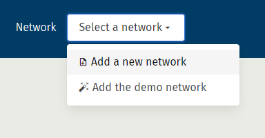
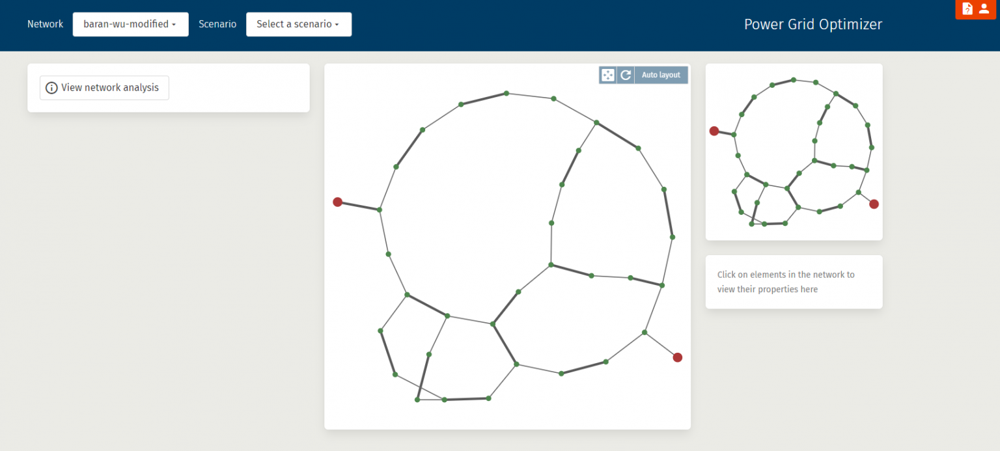
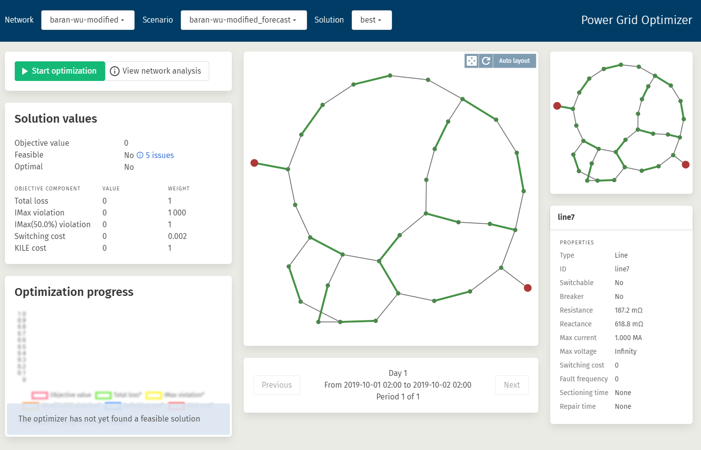
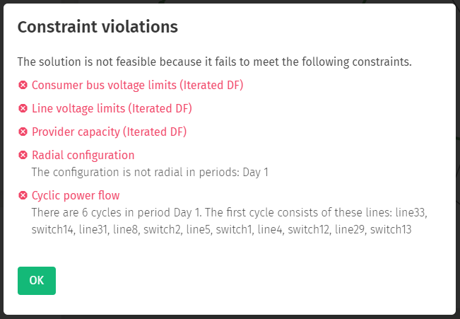

# Web application user manual

We have created a [web application](https://pgosintef.azurewebsites.net/#/) that uses the PGO service to determine an optimal grid configuration. The purpose of this is only to give potential users some idea about how the PGO can be integrated in other applications. For information about how to use the PGO directly, please refer to the [main PGO documentation page](./index.md).

## Getting started

<!-- The PGO web application runs as a web application on SINTEFs web site and uses the PGO cloud service for computations, so you can try out PGO without installing any software on your computer.

To get access to the web application, click the link and register your email address. You can also use your Microsoft account, Github account, or SINTEF account to sign in instantly without creating a new account for PGO. -->

### Setting up the network

When first starting the web application, the screen will be all blank except for the network selection menu. The first step to using PGO is to prepare a network model of the power grid and load it into PGO by clicking _Add a new network_. For a distribution system operator, this requires listing all buses, lines, transformers, etc., and how they are electrically connected, and writing these lists into the PGO data format. See the pages [Introduction to the PGO model](./model.md) and [Modelling examples](./modelling_examples.md).

To try out the PGO web application without having to provide a PGO network file, click the menu item *Add the demo network*.

{: style="text-align: center;"}
{: style="width: 15rem;"}

When a network has successfully been loaded into PGO, additional items will appear on the screen:

 * The **scenario selection menu** is shown in the top ribbon.
 * **Optimization controls** are shown in the left-side column. Only the button *View network analysis* is available before a scenario has been defined.
 * **Map view** is shown in the middle column. You can move around in the network and click buses and lines to see detailed information.
 * **Mini-map view** and **element details** are shown in the right-side column.

{: style="text-align: center;"}
{: style="width: 30rem;"}

Clicking the *View network analysis* button will open a dialog window giving some basic information about the loaded network.

{: style="text-align: center;"}
{: style="width: 30rem;"}

### Setting up the scenario

After the network has been successfully loaded, the next step is to define a scenario. The scenario is defined by giving a load forecast for the consumer nodes in the network. The forecast may be for a single period or for multiple consecutive periods.

If you want the configurations to be optimized for switching costs relative to some starting configuration, this configuration should also be given together with the demand forecast.

Both the demand forecast and the optional starting configuration need to be converted to the PGO JSON formats and uploaded through the dialog window that appears when clicking the *Add a new scenario menu* item in the scenario selection menu.

{: style="text-align: center;"}
{: style="width: 30rem;"}

When a scenario has been successfully loaded into PGO, additional items will appear on the screen:

 * The **solution selection menu** appears in the top ribbon.
   * **Optimization controls** are extended with further items:
   * **Start optimization** button.
   * **Solution values** item shows whether a feasible solution has been found and lists the objective components.
   * **Optimization progress** chart shows how the best solution’s objective value is changing over time when the optimization is running.
 * **Period selector** menu in the middle column allows browsing through the demand forecast periods.

{: style="text-align: center;"}
{: style="width: 30rem;"}

When the configuration is not yet feasible, the *Feasible* item in *Solution values* will contain a button for viewing the remaining feasibility issues. Clicking this button opens a detailed description of the feasibility issues.

{: style="text-align: center;"}
{: style="width: 30rem;"}

### Managing the optimization process

After clicking the *Start optimization* button in the *Optimization controls*, the PGO cloud service will start searching for configurations. The current best configuration’s objective value components are plotted in the *Optimization progress* chart.

The default optimization objectives are:

 * Total loss: measures the thermal loss in W.
 * IMax violation: a high weight is assigned to exceeding the maximum allowable current on individual lines.
 * IMax (50.0%) violation: a lower weight is assigned to exceeding 50% of the maximum allowable current on individual lines.
 * Switching cost: a low weight is given to the cost of opening or closing a switch from one period to another. Note that a switching cost factor for each individual switch is given in the network data.
 * KILE cost: (Norwegian) regulation of quality of supply.

{: style="text-align: center;"}
{: style="width: 20rem;"}

When the *Stop optimization* button is clicked, the current best configuration will be loaded into the map view and can be inspected by moving around the map and clicking on elements for details.

{: style="text-align: center;"}
{: style="width: 30rem;"}

The symbols have the following meaning:

 * Red circles are providers.
 * Green circles are consumers.
 * Gray circles are transition buses.
 * Green lines are lines with closed switches.
 * Dashed red lines are lines with open switches, i.e. not connected.
 * Gray lines are unswitchable lines.

## Limitations

In order to limit the compute load on the server, and since this application is meant as demonstration only, we have restricted its usage in the following ways:

- The number of networks is limited to 2
- The number of optimization sessions is limited to 2, and each optimization can only run for 12h consecutively
- An optimization session can only be active for 24h before being removed.

<!-- > TODO: also size limitation? What is the limit? -->

