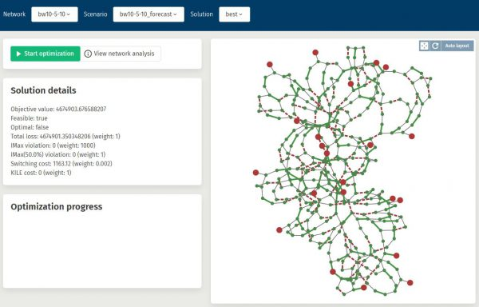

# Power Grid Optimizer

**The *Power Grid Optimizer* (PGO) is an open source (LGPL-licenced) software for optimizing the configuration of power distribution grids.**

Its uses include decision support on different time scales, including the choice of an optimal static ("default") configuration as well as a dynamic re-configuration of the grid in response to forecasted changes in demand, production and/or grid capacity, or in fault or maintenance situations. Using a tool that enable such optimal (re-) configuration will greatly improve grid reliability and cost-efficiency. The software has been tested for actual distribution grids, and the resulting improvements in grid configuration (in this case power loss) have been verified by actual implementation and measurement.

The PGO is being developed by SINTEF in collaboration with distribution system operators ([DSOs](http://energywiki.eyp.org/view/Distribution_System_Operators_(DSOs))), 
as a community effort (see the section [Get Involved](#get-involved) below). 
Our aim is two-fold:
- To provide DSOs with a flexible tool for both long and short term grid configuration.
- To provide the scientific community with a technological basis for further research and innovation on 
configuration-related optimal powerflow problems.

The Power Grid Optimizer can be used in two main ways:
- In process, through a .NET API
- As a service, through an http API. 

Through either of these APIs, the user can upload network data, optimize the grid configuration with respect to a given
*objective function* (e.g. power loss and/or reliability), and retrieve the results. 
The PGO can also be used to compute power flow for given input configurations, 
and to assess the configuration quality.

The software is available as open source, or as a Docker image; see detailed information at [github](https://github.com/SINTEF-Optimization/pgo).
In these pages, we give a high level introduction to the software, and how to use it. The target audience is
DSOs, as well as software developers who want to integrate the PGO with their own solutions.

Further reading:
- A more detailed introduction to the software, what it can do, and how it can be used, can be found in the [introduction to the PGO](Background.md).
- A complete overview of all PGO documentation can be found at the [main PGO documentation page](index.md).

## Get involved!
The development of the PGO is a community effort. The research has been mainly done by SINTEF, but in close collaboration with a number of DSOs, and with funding from the Research Council of Norway (see below).

We have released the PGO as open source to encourage a broader dissemination of the technical results of this research. Also, we hope to involve both the DSO industry, their software suppliers, and academia in a joint research and innovation effort on topics related to distribution grid management and optimal power flow. 
We believe that further developing the PGO, and related technologies, is a good way to fast-track the industrial exploitation of research results, and that this will contribute to increase the pace of innovation in the industry.

If these topics interest you, please get in touch by sending an e-mail to [pgo@sintef.no](mailto:pgo@sintef.no).

If you want to simply use the PGO, feel free to download it from the [github page](https://github.com/SINTEF-Optimization/pgo).
SINTEF also offers integration support for the PGO. 

## Acknowledgements
The PGO has been developed through several research and innovation initiatives,
including the following projects partially sponsored by the Research Council of Norway:
- Energytics ([RCN project number 269377](https://prosjektbanken.forskningsradet.no/project/FORISS/269377?Kilde=FORISS&distribution=Ar&chart=bar&calcType=funding&Sprak=no&sortBy=date&sortOrder=desc&resultCount=30&offset=0&Fritekst=energytics)) 
- KogniGrid ([RCN project number 281793](https://prosjektbanken.forskningsradet.no/project/FORISS/281793?Kilde=FORISS&distribution=Ar&chart=bar&calcType=funding&Sprak=no&sortBy=date&sortOrder=desc&resultCount=30&offset=0&Fritekst=kognigrid))
- Nextgrid  ([RCN project number 340958](https://prosjektbanken.forskningsradet.no/project/FORISS/340958?Kilde=FORISS&distribution=Ar&chart=bar&calcType=funding&Sprak=no&sortBy=date&sortOrder=desc&resultCount=30&offset=0&Fritekst=nextgrid))

<!-- ----
OLD Text:
----

The choice of configuration in a power distribution grid directly impacts the grid’s reliability and cost-efficiency. The ability to choose the best possible configuration, both long term and in short term management, is therefore critical to successful [DSO](http://energywiki.eyp.org/view/Distribution_System_Operators_(DSOs)) operations. A general introduction to the optimisation of distribution grids, and how to determine a robust and cost-efficient configuration, can be found [here](background.md).

The Power Grid Optimizer consists of two parts:

 * The PGO service.
 * The PGO web application.

The purpose of these pages is to make this software available to DSO’s and to third party system developers. You will find that some of the contents requires that you create a user (for free), and log in.

## The PGO service

This is the PGO brain, which computes optimal distribution grid configurations. It has a [http-based](https://pgosintef.azurewebsites.net/swagger/index.html) API which is intended for use by other software, written either by the DSO or by a third party software vendor. This API can be used to upload network data, compute suitable grid configurations, and retrieve the results. It can also be used to compute power flow for input configurations, and to assess these in terms of e.g. power loss or reliability.
In addition to the on-line API, we also offer licences for local installation of the service.
An introduction to the PGO service may be found in the [background section](background.md). Documentation on how to use the API can be found in the [documentation section](documentation.md).

## The Web Application
{: style="float: right; width: 15rem;"}

This on-line web application provides a user interface to the PGO service. It uses the PGO service through the API mentioned above.

Please take a look, and [try it out](https://pgosintef.azurewebsites.net/#/)!
It should be quite easy to use, but if you get stuck please consult the [web application user manual](documentation/web_app_user_manual.md).

The intention of the web application is three fold:

1. To demonstrate how the PGO service works. For this purpose usage is free, but you will be limited e.g. in the size of networks that you can compute for.
2. To provide DSOs with a simple user interface that can be used e.g. to compute good “default grid configurations”. Such usage requires a licence.
3. As a useful tool for software developers during the work of integrating the PGO service with third party software. -->
