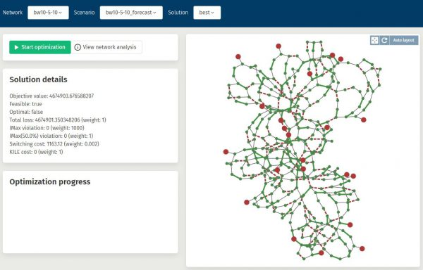

**The *Power Grid Optimizer* (PGO) is a software developed by SINTEF for optimizing the configuration of distribution grids.**

The choice of configuration in a power distribution grid directly impacts the grid’s reliability and cost-efficiency. The ability to choose the best possible configuration, both long term and in short term management, is therefore critical to successful [DSO](http://energywiki.eyp.org/view/Distribution_System_Operators_(DSOs)) operations. A general introduction to the optimisation of distribution grids, and how to determine a robust and cost-efficient configuration, can be found [here](background.md).

The Power Grid Optimizer consists of two parts:

 * The PGO service.
 * The PGO web application.

The purpose of these pages is to make this software available to DSO’s and to third party system developers. You will find that some of the contents requires that you create a user (for free), and log in.

## The PGO service

This is the PGO brain, which computes optimal distribution grid configurations. It has a [http-based](https://pgosintef.azurewebsites.net/swagger/index.html) API which is intended for use by other software, written either by the DSO or by a third party software vendor. This API can be used to upload network data, compute suitable grid configurations, and retrieve the results. It can also be used to compute power flow for input configurations, and to assess these in terms of e.g. power loss or reliability.
In addition to the on-line API, we also offer licences for local installation of the service.
An introduction to the PGO service may be found in the [background section](background.md). Documentation on how to use the API can be found in the [documentation section](documentation.md).

## The Web Application
{: style="float: right; width: 15rem;"}

This on-line web application provides a user interface to the PGO service. It uses the PGO service through the API mentioned above.

Please take a look, and [try it out](https://pgosintef.azurewebsites.net/#/)!
It should be quite easy to use, but if you get stuck please consult the [web application user manual](web-application-user-manual.md).

The intention of the web application is three fold:

1. To demonstrate how the PGO service works. For this purpose usage is free, but you will be limited e.g. in the size of networks that you can compute for.
2. To provide DSOs with a simple user interface that can be used e.g. to compute good “default grid configurations”. Such usage requires a licence.
3. As a useful tool for software developers during the work of integrating the PGO service with third party software.
